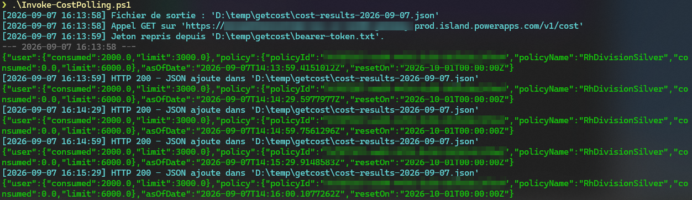
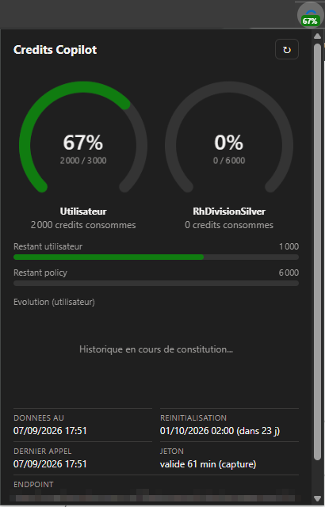

# API cost

> [!WARNING]
> **Projet developpe en vibe coding et par retro-engineering.**
>
> L'endpoint `/v1/cost` du runtime Aether n'est ni public ni documente : tout ce
> qui suit a ete deduit par observation du client web (formats de reponse,
> en-tetes attendus, applications autorisees, endpoints regionaux). Rien n'est
> contractuel.
>
> Microsoft peut modifier ou retirer cet endpoint, son schema de reponse ou sa
> liste d'applications acceptees a tout moment et sans preavis. **La fiabilite
> dans le temps n'est donc pas assuree** : ce code peut cesser de fonctionner du
> jour au lendemain. A utiliser a vos propres risques, sans aucune garantie.

Deux clients pour l'endpoint `/v1/cost` :

- `Invoke-CostPolling.ps1` : polling en PowerShell (ci-dessous) ;
- `extension/` : extension Chrome/Edge affichant la consommation en graphiques,
  avec recuperation automatique du jeton de session (voir
  [extension/README.md](extension/README.md)).

## Apercu

### Script PowerShell



### Extension Chrome/Edge



## Polling de l'API cost

Interroge `GET /v1/cost` du runtime Aether (Microsoft 365 Copilot) et archive
chaque reponse JSON.

## Authentification

Le script obtient lui-meme un jeton aupres de Microsoft 365 via le flux
**device code** OAuth2 :

1. il affiche une URL et un code ;
2. vous vous connectez une fois dans le navigateur ;
3. il conserve un `refresh_token` et renouvele ensuite le jeton sans
   interaction.

Ordre de resolution du jeton :

1. parametre `-BearerToken` ;
2. `bearer-token.txt`, s'il contient un jeton non expire ;
3. cache local `token-cache.json`, s'il contient un jeton non expire ;
4. renouvellement silencieux via `refresh_token` ;
5. connexion interactive par device code.

L'expiration est lue dans la revendication `exp` du jeton : un jeton perime est
ignore au lieu de provoquer un appel voue a l'echec.

Pour forcer une reconnexion :

```powershell
.\Invoke-CostPolling.ps1 -Login
```

### Stockage des secrets

- `token-cache.json` contient l'`access_token` et le `refresh_token` chiffres
  par DPAPI, donc lisibles uniquement par votre compte Windows sur cette
  machine.
- `bearer-token.txt` contient l'`access_token` en clair, pour reutilisation
  dans d'autres outils.
- Les deux fichiers sont exclus par `.gitignore`.

### Parametres d'identite

| Parametre    | Defaut                                                  |
|--------------|---------------------------------------------------------|
| `-TenantId`  | `organizations`                                          |
| `-ClientId`  | `1950a258-227b-4e31-a9cf-717495945fc2` (Azure PowerShell) |
| `-Scope`     | `96ff4394-9197-43aa-b393-6a41652e21f8/.default`         |
| `-Authority` | `https://login.microsoftonline.com`                     |

Le GUID `96ff4394-...` est la ressource du runtime Aether en production.

L'API n'accepte qu'une liste fermee d'applications appelantes : un jeton
parfaitement valide est refuse avec `invalid_appid` si le `ClientId` n'y figure
pas. Le script detecte ce cas, n'essaie pas de renouveler inutilement le jeton
et affiche la liste des applications acceptees. Clients publics connus qui
fonctionnent :

```powershell
.\Invoke-CostPolling.ps1 -Login -ClientId '1950a258-227b-4e31-a9cf-717495945fc2'  # Azure PowerShell (defaut)
.\Invoke-CostPolling.ps1 -Login -ClientId 'd3590ed6-52b3-4102-aeff-aad2292ab01c'  # Microsoft Office
```

Azure CLI (`04b07795-...`) n'est **pas** autorise par cette API.

Preciser `-TenantId` accelere la connexion et evite les ambiguites de compte :

```powershell
.\Invoke-CostPolling.ps1 -TenantId '<votre-tenant-id>'
```

## Lancement

```powershell
.\Invoke-CostPolling.ps1
```

Le script appelle l'URL en GET toutes les 30 secondes. Les en-tetes
`x-tenant-id` et `x-user-id` sont derives des revendications `tid` et `oid` du
jeton, comme le fait le client web.

## Fichier de sortie

Sans `-OutputFile`, le script ecrit dans un fichier journalier
`cost-results-AAAA-MM-JJ.json` :

```powershell
.\Invoke-CostPolling.ps1 -OutputFile .\resultats.json
```

Si le fichier existe deja et n'est pas vide, un separateur portant la date et
l'heure de lancement est ajoute avant les nouveaux resultats :

```text
{"exemple":"execution precedente"}
--- 2026-09-07 15:08:11 ---
{"exemple":"execution courante"}
```

## Gestion des erreurs

- **401 jeton expire ou invalide** : le script affiche le detail, renouvele le
  jeton puis rejoue l'appel une fois. Si le 401 persiste, il s'arrete.
- **401 `invalid_appid`** : renouveler ne servirait a rien, car le nouveau jeton
  porterait le meme `appid`. Le script s'arrete immediatement et liste les
  applications acceptees.
- **Autre statut different de 200** : arret immediat.

Dans tous les cas, les erreurs sont affichees dans la console uniquement :
aucune donnee d'erreur n'est ecrite dans le fichier de trace. Le code de sortie
vaut alors `1`.

Un jeton mis en cache dont l'`appid` ne correspond pas au `-ClientId` demande
est ignore, ce qui evite de rester bloque sur un jeton refuse apres avoir
change de client.

## Couleurs de la console

- cyan : messages du script ;
- vert : JSON renvoye par l'API ;
- jaune : authentification ;
- gris fonce : separateur d'execution ;
- rouge : erreurs.

## Autres options

```powershell
.\Invoke-CostPolling.ps1 -Once                 # un seul appel
.\Invoke-CostPolling.ps1 -IntervalSeconds 60   # intervalle personnalise
.\Invoke-CostPolling.ps1 -Url 'https://...'    # autre endpoint regional
```

L'endpoint regional correct est indique par
`GET https://cowork.<geo>-ia888.gateway.prod.island.powerapps.com/v1/routing`.
