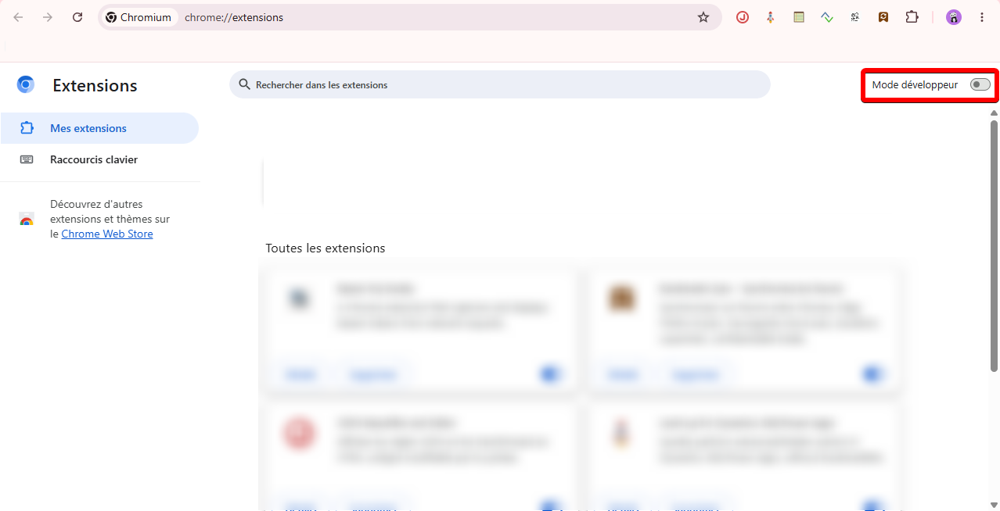
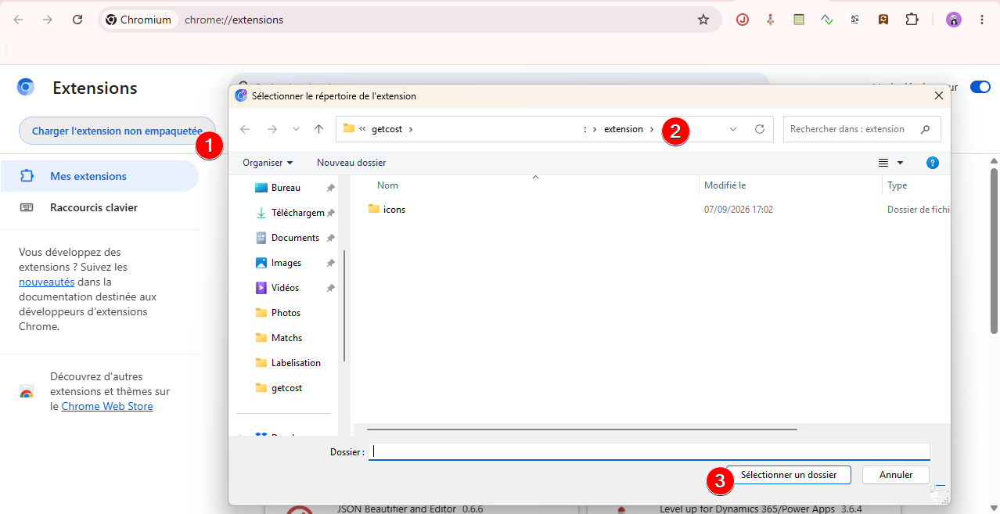
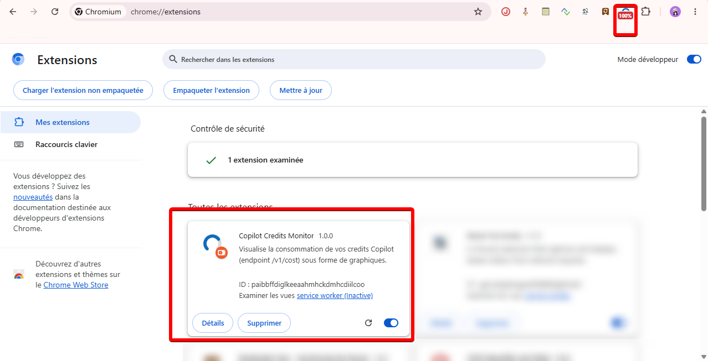

# Copilot Credits Monitor (extension Chrome)

Extension Chrome/Edge (Manifest V3) qui affiche graphiquement la consommation
de vos credits Copilot, a partir du meme endpoint que `Invoke-CostPolling.ps1` :

```
GET https://<region>.gateway.prod.island.powerapps.com/v1/cost
Authorization: Bearer <jeton de session>
```

## Recuperation du jeton

Aucun jeton n'est demande a l'utilisateur. Le service worker observe les
requetes sortantes (`chrome.webRequest.onBeforeSendHeaders`) vers
`*.powerapps.com` et capture l'en-tete `Authorization` de **tout appel vers le
runtime Copilot** (`*.gateway.prod.island.powerapps.com`) — pas seulement les
appels a `/v1/cost`, car la page n'appelle pas forcement ce chemin. L'URL de
l'endpoint est alors deduite : `https://<hote runtime>/v1/cost` (l'hote varie
selon la region du tenant : `-eus`, `-wus`, ...).

Regles appliquees :

- seul un jeton au format JWT et non expire est conserve ;
- un jeton valide n'est pas remplace par un jeton expirant plus tot ;
- sur reponse `401`/`403`, le jeton est supprime et l'ecran d'accueil revient.

> Important : l'extension ne voit que les requetes emises **apres** son
> chargement. Apres l'installation, rechargez l'onglet Microsoft 365 Copilot.

En dernier recours, l'ecran d'accueil propose **Saisir un jeton manuellement**
(coller le JWT, et si besoin l'URL exacte de l'endpoint).

## Installation

L'extension n'est pas publiee sur le Chrome Web Store : elle se charge en mode
developpeur, directement depuis le dossier `extension/` de ce depot.

### 1. Ouvrir la page des extensions et activer le mode developpeur

Saisir `chrome://extensions` (ou `edge://extensions`) dans la barre d'adresse,
puis activer l'interrupteur **Mode developpeur** en haut a droite.



### 2. Charger l'extension non empaquetee

Le bouton **Charger l'extension non empaquetee** apparait une fois le mode
developpeur actif.

1. cliquer sur **Charger l'extension non empaquetee** ;
2. naviguer jusqu'au dossier `extension/` du depot ;
3. valider avec **Selectionner un dossier**.

> Selectionnez bien le dossier `extension/` lui-meme (celui qui contient
> `manifest.json`), et non la racine du depot.



### 3. Verifier le chargement

La carte **Copilot Credits Monitor 1.0.0** apparait dans la liste et l'icone
s'ajoute a la barre d'outils. Le badge affiche le pourcentage de credits
consommes des que des donnees sont disponibles.



Si l'icone n'est pas visible, cliquez sur le bouton **Extensions** (piece de
puzzle) de la barre d'outils et epinglez **Copilot Credits Monitor**.

> [!IMPORTANT]
> L'extension ne capture que les requetes emises **apres** son chargement.
> Rechargez l'onglet Microsoft 365 Copilot juste apres l'installation, sinon le
> jeton ne sera pas detecte.

### Mise a jour apres modification du code

Apres avoir modifie un fichier de `extension/`, cliquez sur l'icone de
rafraichissement de la carte de l'extension (fleche circulaire), puis rechargez
l'onglet Copilot.

## Utilisation

1. Ouvrir (ou recharger) Microsoft 365 Copilot dans un onglet ;
2. cliquer sur l'icone de l'extension.

Le popup affiche :

- deux jauges circulaires (quota utilisateur et quota de la policy) avec code
  couleur vert / orange / rouge selon le taux d'utilisation ;
- les credits restants sous forme de barres ;
- une courbe d'evolution de la consommation utilisateur (historique local, avec
  la limite en pointilles) ;
- les dates `asOfDate`, `resetOn` (avec compte a rebours), le dernier appel,
  l'etat du jeton (validite restante, source) et l'endpoint utilise ;

Le badge de l'icone indique le pourcentage consomme ; il est rafraichi
automatiquement toutes les 15 minutes (`chrome.alarms`) et a chaque ouverture du
popup.

## Donnees et confidentialite

Tout reste local (`chrome.storage.local`) : jeton, derniere reponse et
historique (500 points max). Aucune donnee n'est envoyee ailleurs qu'a
l'endpoint `/v1/cost`. Le bouton **Effacer les donnees locales** vide le
stockage.

## Structure

| Fichier         | Role                                                        |
| --------------- | ----------------------------------------------------------- |
| `manifest.json` | Manifest V3, permissions `webRequest`, `storage`, `alarms`   |
| `background.js` | Capture du jeton, appel de l'API, historique, badge          |
| `popup.html`    | Structure du popup                                           |
| `popup.css`     | Styles (theme clair / sombre automatique)                    |
| `popup.js`      | Rendu des jauges, barres et courbe (canvas, sans dependance) |
